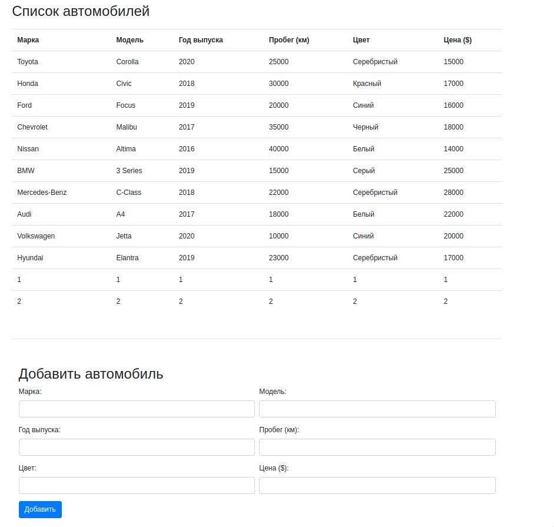
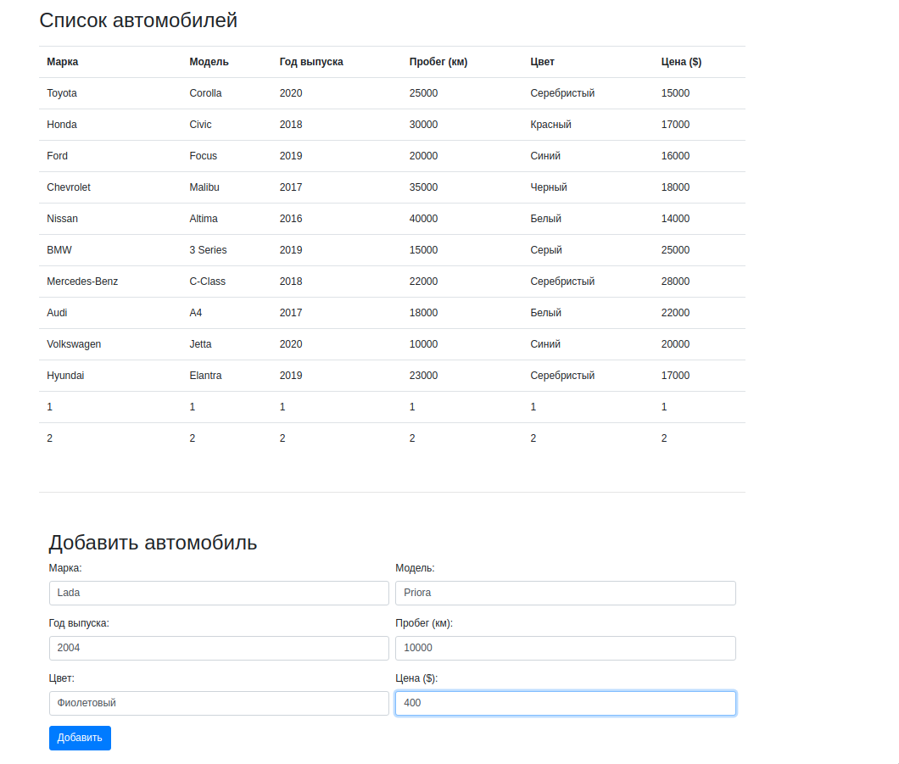
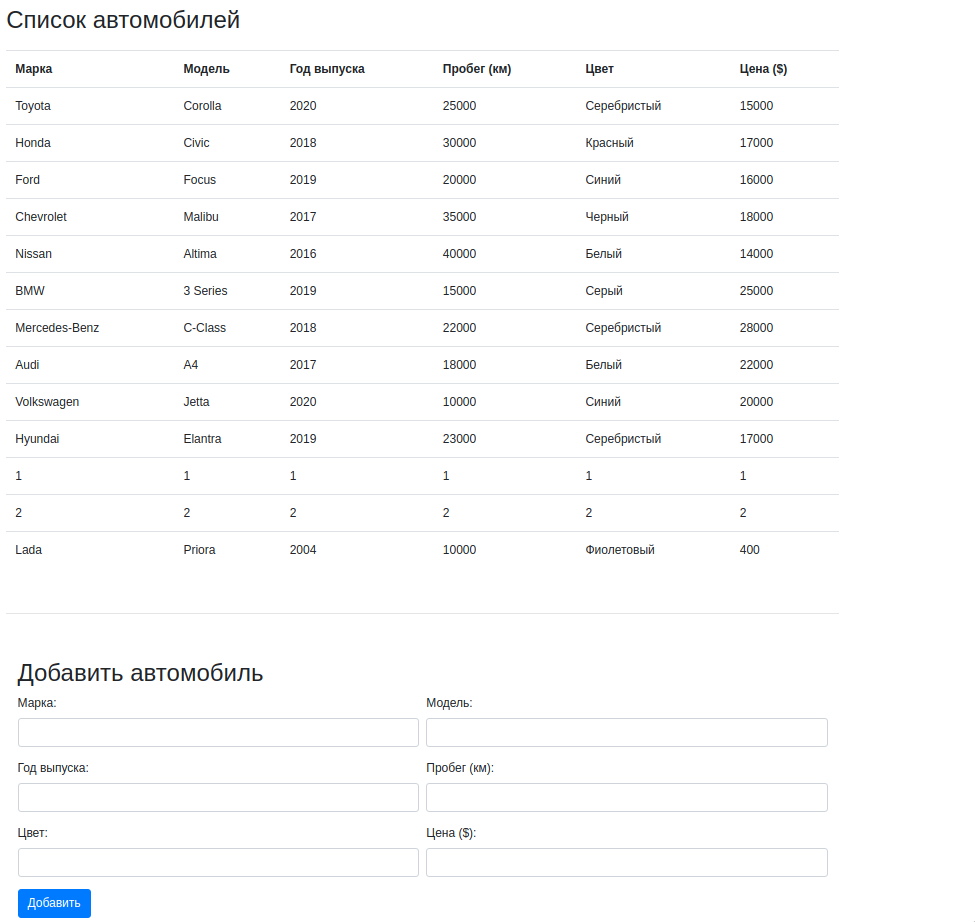

# ООП, 4 сем, лаб 3, вариант 2

Разработать страницу отображающую список автомобилей, с хранением их на сервере в файле, передача данных осуществляется по JSON, клиент и сервер общаются по средствам передачи данных. На странице предусмотреть форму добавления объектов в список.

GET реализован через JS, POST через Java для изменения локальных и серверных файлов. После рестарта сервера информация об объектах сохраняется.
### Страница, отображающая список автомобилей из JSON

### Добавление нового объекта через форму

